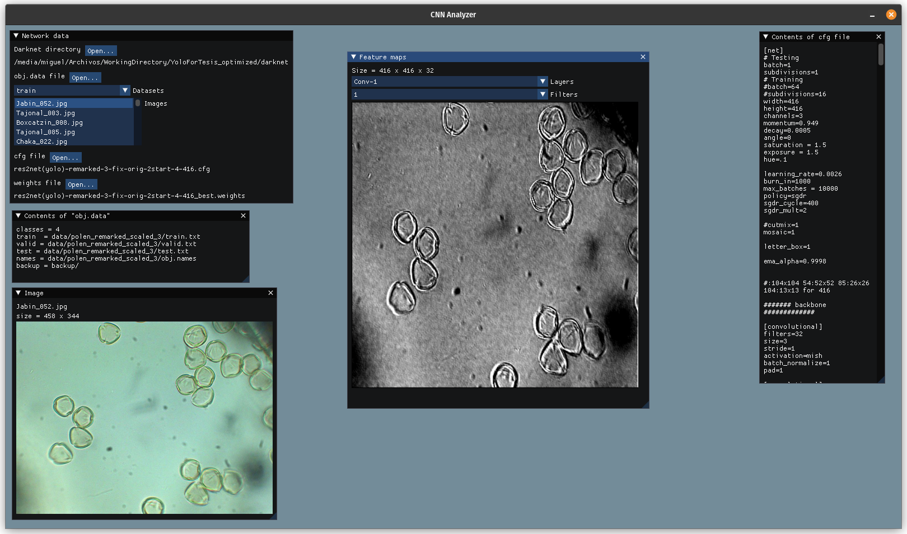

# CNN-Analyzer
A simple CNN feature map visualizer

Compile instructions

1. Open a terminal in lib/darknet directory

	1.1. Change GPU flags, gpu=1, cudnn=1, cudnn_half=1, use_cpp=1

	1.2. Change cudnn, flags where nvidia libraries are installed, in PopOS is /usr/lib/cuda/
	
2. Do `make -j libdarknet.so`

3. Return to **cnn_analyze** main directory

4. Do 
	`cd lib/ImGuiFileDialog

	git checkout Lib_Only`

5. Do `make -j`

To run execute the **run.sh** script like this `sh run.sh`
